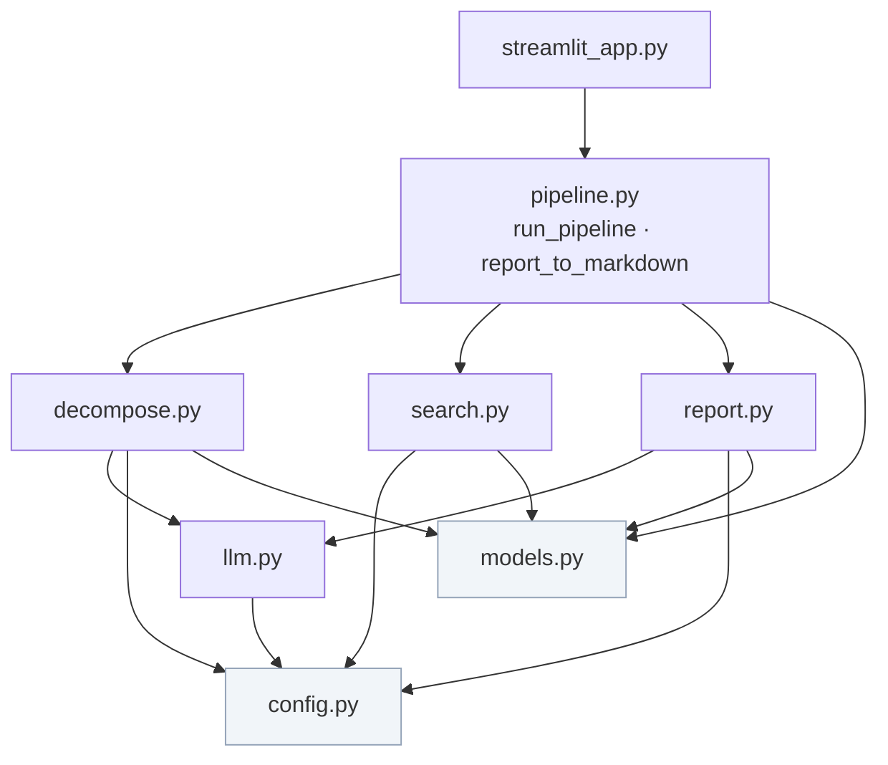

# 代码导览

本页把 PRD 章节和验收标准映射到 `app/` 下的具体模块，让一个新贡献者能在 5 分钟内知道"某个功能在哪个文件里"。

## PRD 章节 ↔ 代码模块

| PRD 章节 | 模块文件 | 一句话职责 | 对应 AC |
| :--- | :--- | :--- | :--- |
| 一、产品定位 | `app/streamlit_app.py` | Streamlit 单页前端，顶部文案即产品定位 | — |
| 三、核心功能 | `app/decompose.py` | 问题拆解为 3-5 个子搜索词 | AC-01 |
| 三、核心功能 | `app/search.py` | 多轮联网搜索（Tavily > Bing > Mock） | AC-02 |
| 三、核心功能 | `app/report.py` | 报告生成，结构化四段输出 | AC-03 |
| 五、技术栈 | `app/config.py` | 环境变量与运行配置，模式判定 | — |
| 五、技术栈 | `app/llm.py` | OpenAI 兼容 LLM 客户端 | — |
| 六、数据流 | `app/pipeline.py` | 核心编排：拆解 → 搜索 → 验证 → 报告 | — |
| 数据模型 | `app/models.py` | Source / DataPoint / Report 数据模型 | — |

## 模块依赖关系

## 各模块要点

### `app/pipeline.py` — 编排核心

`run_pipeline(question, on_progress)` 是唯一入口，按 PRD 第六节串联四个阶段。`on_progress` 是 Streamlit 的进度回调。

`report_to_markdown(report)` 把结构化 `Report` 渲染为 Markdown，供前端展示。

### `app/decompose.py` — 问题拆解（AC-01）

有 LLM 时调模型拆解；无 LLM 时回退基于规则的 mock 拆解（去停用词 + 取前几个 token）。拆解结果对用户可见，满足"便于人工校验"。

### `app/search.py` — 多轮联网搜索（AC-02）

`SearchBackend` Protocol 定义统一接口，三个适配器：`TavilyBackend`、`BingBackend`、`MockBackend`。`_pick_backend()` 按 key 优先级选择。

### `app/report.py` — 报告生成（AC-03）

有 LLM 时调模型整合搜索结果为结构化报告；无 LLM 时基于 Source 直接合成 mock 报告。输出固定四段：摘要 → 分点详述 → 风险提示 → 参考资料。

### `app/config.py` — 运行配置

`Settings` dataclass 从环境变量读取密钥与拆解参数。`has_llm` / `has_search` / `is_mock` 三个属性判定整体运行模式。

### `app/llm.py` — LLM 客户端

OpenAI 兼容接口，`llm_complete(system, user, *, temperature, max_tokens) → str`。无 `OPENAI_API_KEY` 时上层应走 mock 流程，不直接调用本模块。

### `app/models.py` — 数据模型

Pydantic 模型，定义流程中各阶段的结构化产物：

| 模型 | 含义 |
| :--- | :--- |
| `Source` | 一条搜索结果（标题、url、snippet、来源类型、权威等级） |
| `DataPoint` | 报告中的一个论点（claim、sources、conflict、has_evidence） |
| `Report` | 结构化报告（question、subqueries、summary、points、risks、references） |

## 入口脚本

`run.py` 是启动入口，拼接 `streamlit run` 的命令行参数，支持 `python run.py [port]` 指定端口。

> 想在本地改这些代码？读 [本地开发](/development/local-dev)。
